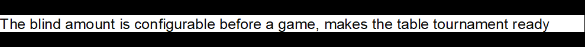
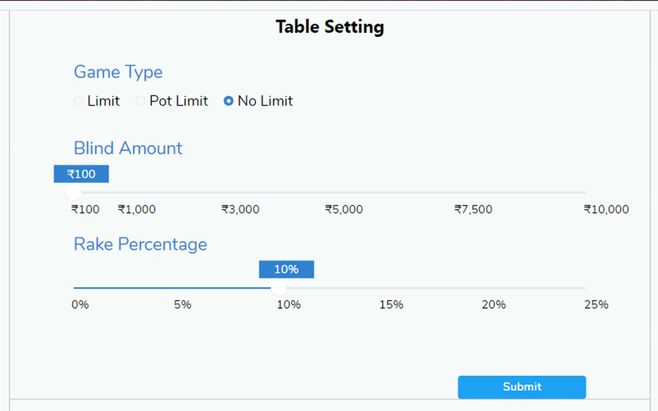
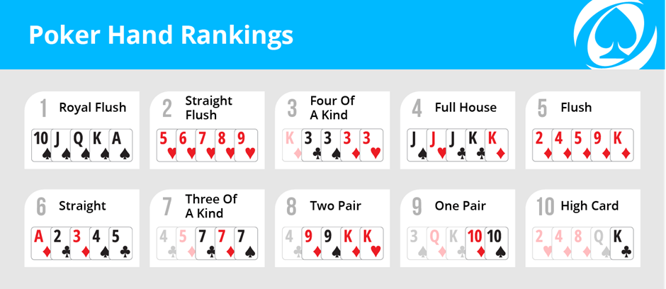

# Poker @ Fun Palace

# The Game Rules

## What is poker (2 lines on the game) ?
The game of poker is a card game played among two or more players for several rounds.

Texas Hold'em is a variant of community card poker.
In this kind of poker, 2 cards(player cards) are given to each player and 5 cards(community) are revealed to the whole table, and each player can
use those cards to build his or her best 5-card hand.

## Game Format
Fully Electronic Table with casino dealer takes care of Buy-in, Cash-out and Dealing.
Cards are drawn electronically to the player tablets.
Bets are accepted electronically from player tablets.

## Texas Hold’em Rules( including the blind structure)

### Dealer Selection
The 'High Card to deal' is done.A single card is drawn to each player in clockwise direction.The highest card seat 
is marked as Dealer.In case more than 1 player has same value card, the left most player is marked as Dealer.

### Rounds
A round begins with compulsory blind bets. Texas Hold-em  has a "big blind"and a "small blind".
The big blind is an amount twice as much as the small blind. The player to the left of the dealer 
makes the small blind bet, and the next player to the left makes the big blind bet.

After these bets, each player is dealt 2 cards face-down (hidden from other players). 
This phase is called the pre-flop, and each player's hidden cards are called that player's cards. 

During the play, player and community cards are dealt electronically from a standard 52-card
deck(shuffled before every game), and the goal of each player is to have the
best 5-card hand at the table.

The game is over when a single player has won all the money at the table.

### Pre-Flop Round Betting
The pre-flop betting phase typically begins after players have been dealt their cards with 
action on the player to the left of the big blind.

Each player takes a turn betting, and these turns are taken clockwise around the table.
There are a number of options each time a player takes his or her turn betting:

Check: If no money was raised since the player's last turn, that player can check and 
pass to the next player. If the round has a blind bet, then each player must call the 
blind bet before they can check.

Call: If money was raised since the player's last turn, that player can call and bet 
money equal to the difference in the amount of the current bet and the amount that 
the player last bet.

Raise: A player can raise the amount of the bet by betting more money than the 
current bet.

Fold: A player can refuse to bet. This is called a fold, and that player is effectively
out of the round. A player that folds gives up all money that he or she bet that round. 
It may seem wasteful to fold, but this is often the best strategy when a player knows that 
he or she is not likely to win the round.

All-in: In certain situations, a player will put all of his or her remaining chips 
into the pot. This is called an all-in. 

The round of betting is over once each player at the table has either called, checked, 
folded, or made an all-in bet.

### Flop Round Betting
After the pre-flop betting phase, 3 cards are dealt face-up (revealed to all players) at the 
center of the table. These 3 cards are called the flop. They are community cards, meaning that 
each player uses them to build his or her 5-card hand. After the flop is dealt, another betting 
phase begins with the player to the left of the dealer.

### Turn Round Betting
After the flop betting phase, another community card is dealt face-up next to the flop. 
This card is called the turn. After the turn is dealt, another betting phase begins with the 
player to the left of the dealer.

### River Round Betting
After the turn betting phase, another community card is dealt face-up next to the others. 
This card is called the river. After the river is dealt, a final betting phase begins with 
the player to the left of the dealer.

### Winner
Each player still in the round reveals their hands simultaneously. Each player makes the best 
possible 5-card hand available from his or her pocket cards and the community cards. Because 
Texas Hold-Em uses community cards, ties are more common than with other variants, and special 
rules designate how to break ties based on the specific cards contained in each player's hand. 
Even so, draws are still possible, and the pot is shared if this is the case. Otherwise, the 
player with the best 5-card hand wins the pot.

After the round is over, a new round with blinds begins.

## What is Rake, how much is the rake at fun palace?
Rake is made configurable in the range 0 - 25%, and can be set by fun palace time to time.

## When is Rake applicable?
In Tournament mode Rake is set as 0.
In Normal mode Rake shall be set in a range of 1 - 25% 

## The Card Ranking

